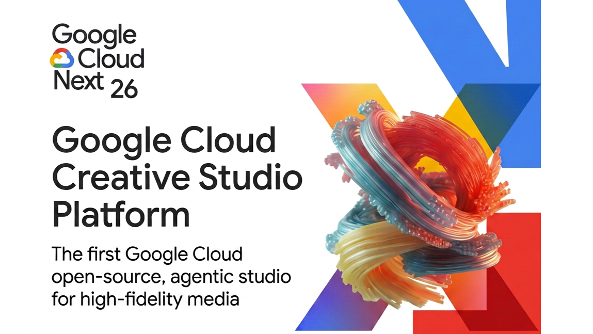
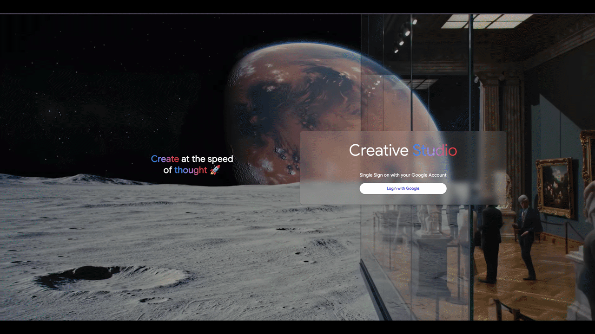

<div align="center">
  
  <br>
  <br>
  <h1 align="center">Google Cloud Creative Studio 플랫폼</h1>
  <p align="center"><b>Google Cloud 최초의 오픈소스 올인원 에이전틱 스튜디오 🚀<br>고품질 멀티미디어 콘텐츠 생성을 위한 통합 플랫폼</b></p>

  <p align="center">
    
    
    
    
    <a href="https://github.com/pylint-dev/pylint"></a>
    <a href="https://github.com/google/gts"></a>
    
  </p>

</div>

---

Creative Studio는 여러분의 Google Cloud 프로젝트에 직접 배포할 수 있는 종합 생성형 AI 플랫폼입니다. Vertex AI에서 제공하는 Google의 최신 생성형 AI 모델을 한 곳에서 체험할 수 있는 강력한 레퍼런스 구현체이자 크리에이티브 스위트입니다.

크리에이터, 마케터, 개발자를 위해 설계된 이 애플리케이션은 최첨단 멀티모달 기능을 직접 체험하고 활용할 수 있는 인터랙티브 환경을 제공합니다.

> ###### _이 프로젝트는 Google의 공식 지원 제품이 아닙니다. [Google 오픈소스 소프트웨어 취약점 보상 프로그램](https://bughunters.google.com/open-source-security)의 적용 대상이 아닙니다._

---

## ☁️ Google Cloud Next '26 & Izumi 통합

**Google Cloud Next '26**에서 저희 팀을 만나보세요! **Izumi Agent**와의 심층 통합을 직접 시연할 예정입니다.

멀티 에이전트 멀티미디어 생태계에 대한 자세한 내용은 [Izumi Agent 저장소](https://github.com/GoogleCloudPlatform/genmedia-izumi-agent/tree/main)를 참고해 주세요.

---

## 주요 기능 🎨

Creative Studio는 단순 데모를 넘어, 개발자가 실무에 바로 활용하고 발전시킬 수 있는 고급 기능을 구현합니다:

**🎬 고급 동영상 생성 (Veo):**

- 텍스트 프롬프트로 고품질 동영상을 생성합니다.
- 이미지-to-동영상(R2V) 기능을 통해 참조 이미지를 업로드할 수 있습니다.
- 이미지를 에셋 일관성(ASSET) 또는 스타일 전환(STYLE)으로 구분하여 활용합니다.

**🖼️ 고화질 이미지 생성 (Imagen):**

- 상세한 텍스트 설명으로 멋진 이미지를 생성합니다.
- 다양한 창작 스타일, 조명, 구도 설정을 자유롭게 탐색합니다.

**✍️ Gemini 기반 프롬프트 엔지니어링:**

- **프롬프트 재작성:** 사용자 프롬프트를 자동으로 개선·확장하여 더 나은 생성 결과를 도출합니다.
- **멀티모달 평가:** Gemini의 멀티모달 이해력을 활용해 생성된 이미지를 평가하고 피드백을 제공합니다.

**📄 브랜드 가이드라인 통합:**

- PDF 스타일 가이드를 업로드하면 백엔드가 이를 처리하여 생성 콘텐츠에 브랜드 정체성을 자동으로 반영합니다.
- 서버 타임아웃을 우회하고 대용량 파일을 효율적으로 처리하는 GCS Signed URL 기반의 견고한 업로드 메커니즘을 제공합니다.

**👕 가상 피팅 (VTO):**

- 의류 및 모델 등 시스템 수준의 에셋을 사전 등록하는 기능을 포함하며, 가상 피팅 애플리케이션의 기반을 마련합니다.

## GenMedia 스크린샷 | Creative Studio

<p align="center">
  
</p>


## 20분 만에 배포하기!!

아래 스크립트 한 줄을 실행하면 단계별 안내에 따라 인프라 배포와 앱 시작이 완료됩니다:

```
curl https://raw.githubusercontent.com/GoogleCloudPlatform/gcc-creative-studio/refs/heads/main/bootstrap.sh | bash
```

완전히 새로운 GCP 계정에서 Creative Studio를 배포하는 방법은 [녹화 영상](./screenshots/how_to_deploy_creative_studio.mp4)을 참고해 주세요.

### 배포 시 알려진 문제 및 해결 방법

배포 과정에서 발생할 수 있는 주요 문제와 해결 방법입니다.

---

#### 문제 1: OAuth 로그인 오류 — `Error 401: invalid_client / no registered origin`

**증상:** 앱(`https://<project-id>.web.app`)에 접속 후 Google 로그인 시도 시 아래 오류 발생:
> Access blocked: Authorization Error / Error 401: invalid_client / no registered origin

**원인:** `bootstrap.sh`의 Step 11(`update_oauth_client`)은 IAP OAuth 클라이언트에 JavaScript 출처(origin)를 자동 등록하는 단계입니다. 그런데 Google이 2026년 3월에 IAP OAuth Admin API를 완전히 종료하면서, 이 단계가 자동으로 실행되지 않습니다.

**해결 방법 (수동 2분 작업):**

1. [Google Cloud Console — 사용자 인증 정보](https://console.cloud.google.com/apis/credentials)로 이동합니다.
2. `OAuth 2.0 클라이언트 ID` 목록에서 유형이 `웹 애플리케이션`인 항목을 클릭합니다.
3. **승인된 JavaScript 출처** 섹션에 아래 두 URL을 추가합니다:
   ```
   https://<project-id>.web.app
   https://<project-id>.firebaseapp.com
   ```
4. **저장**을 클릭합니다.
5. 브라우저를 새로고침하면 로그인이 정상 동작합니다.

---

#### 문제 2: Firebase Hosting — `Site Not Found`

**증상:** `bootstrap.sh` 완료 후 `https://<project-id>.web.app` 접속 시 "site not found" 페이지 표시.

**원인:** 프론트엔드 Cloud Build 트리거가 최초 배포 시 자동으로 실행되지 않을 수 있습니다.

**해결 방법:**

아래 명령어로 Cloud Build 트리거를 수동으로 실행합니다:

```bash
gcloud builds triggers run <project-id>-trigger \
  --project=<project-id> \
  --branch=main
```

빌드가 완료되면(약 5분 소요) Firebase Hosting에 프론트엔드가 정상 배포됩니다.

---

### 재배포 방법

최신 변경사항을 재배포하려면 포크한 저장소를 `main` 브랜치와 동기화하면 됩니다. GitHub에서 **"Sync with main"** 버튼을 클릭하거나, 로컬에서 `git pull upstream main` 명령어를 실행하세요.

Cloud Build 트리거가 새로운 코드 변경을 자동으로 감지하여 재배포 프로세스를 시작합니다(약 5분 소요).


*💡 팁: 포크가 업스트림 저장소보다 뒤처진 경우, **"Sync fork"** 또는 **"Update branch"** 버튼이 표시되어 클릭 한 번으로 최신 변경사항을 가져올 수 있습니다.*

인프라 변경(예: 새로운 클라우드 리소스 또는 설정)이 있는 경우 Terraform을 수동으로 실행하여 재배포해야 할 수 있습니다. 단, 이런 경우는 드물며, 필요 시 버전 릴리즈 문서에 별도로 안내됩니다.

<video controls autoplay loop width="100%" style="max-width: 1200px;">
  <source src="./screenshots/how_to_deploy_creative_studio.mp4" type="video/mp4">
  브라우저가 동영상 태그를 지원하지 않습니다. <a href="./screenshots/how_to_deploy_creative_studio.mp4">여기서 영상을 다운로드</a>하세요.
</video>

## 시스템 아키텍처


백엔드는 헥사고날 아키텍처(포트 & 어댑터) 원칙에서 영감을 받은 **모듈식 기능 중심 아키텍처**를 따릅니다.

- **구조:** 기술 계층(`/controllers`, `/services`)이 아닌 기능 도메인(`/images`, `/galleries`, `/users`) 별로 코드를 구성합니다.
- **설계 이유:**
  - **확장성:** 애플리케이션이 성장해도 개별 디렉토리가 비대해지는 것을 방지합니다.
  - **유지보수성:** 하나의 기능과 관련된 모든 코드가 한 곳에 모여 있어 이해, 수정, 테스트가 용이합니다.
  - **높은 응집도, 낮은 결합도:** 모듈이 독립적으로 구성되고 서비스 및 DTO라는 명확한 인터페이스를 통해 상호작용하여 시스템이 견고하고 유연합니다.

### 기술 스택

| 분류             | 기술 / 서비스                                            |
| :--------------- | :------------------------------------------------------- |
| **프론트엔드**   | Angular, TypeScript, Angular Material, Tailwind CSS      |
| **백엔드**       | Python, FastAPI, Pydantic                                |
| **데이터베이스** | Google Cloud SQL (PostgreSQL)                            |
| **클라우드**     | Google Cloud Platform (GCP)                              |
| **배포**         | Cloud Run (백엔드), Firebase Hosting (프론트엔드)        |
| **AI 모델**      | Imagen, Veo, Gemini (Vertex AI SDK)                      |

### 의존성

사용하는 API 및 서비스의 의존성 목록입니다. Google API(`'xxxx.googleapis.com'`)는 스크립트가 자동으로 활성화합니다:

- `Github Account` (저장소를 포크하려면 GitHub 계정이 필요합니다)
- `Google Cloud Account` (GCP 프로젝트)

---

- `aiplatform.googleapis.com` (Vertex AI)
- `artifactregistry.googleapis.com` (Artifact Registry)
- `cloudbuild.googleapis.com` (Cloud Build)
- `cloudfunctions.googleapis.com` (Cloud Functions)
- `compute.googleapis.com` (Compute Engine)
- `firebase.googleapis.com` (Firebase)
- `sqladmin.googleapis.com` (Cloud SQL)
- `iamcredentials.googleapis.com` (IAM Service API)
- `iap.googleapis.com` (Cloud Identity-Aware Proxy)
- `identitytoolkit.googleapis.com` (Identity Platform)
- `run.googleapis.com` (Cloud Run)
- `secretmanager.googleapis.com` (Secret Manager)
- `texttospeech.googleapis.com` (Text to Speech)

배포 시 Cloud Shell을 사용하면 필요한 도구가 이미 설치되어 있습니다. 로컬 컴퓨터에서 배포하는 경우, 스크립트가 아래 CLI 도구의 설치 여부를 자동으로 확인하고 누락되었거나 구버전인 경우 설치를 시도합니다.

- `gcloud` (Google Cloud SDK)
- `git`
- `jq` (JSON 처리 도구)
- `firebase-tools` (Firebase CLI)
- `uv` (Python 패키지 설치 도구)
- `terraform` (버전 1.13.0 이상)

## 🛡️ 코드 품질 기준 및 CI/CD

최고 수준의 품질과 보안을 보장하기 위해 로컬 환경과 CI/CD 파이프라인 모두에서 엄격한 스타일 가이드와 자동화 검사를 적용합니다.

### 🎨 코드 스타일 가이드라인
- **Python**: `pylint`과 `black`을 사용하여 [Google Python 스타일 가이드](https://google.github.io/styleguide/pyguide.html)를 준수합니다.
- **TypeScript**: `gts`를 사용하여 [Angular 코딩 스타일 가이드](https://angular.dev/style-guide) 및 [Google TypeScript 스타일 가이드](https://github.com/google/gts)를 따릅니다.
- **커밋 메시지**: [Angular 커밋 메시지 가이드라인](https://github.com/angular/angular/blob/main/contributing-docs/commit-message-guidelines.md)을 권장합니다.

### 🌿 브랜치 전략
[Git Flow](https://nvie.com/posts/a-successful-git-branching-model/) 브랜치 모델을 따릅니다. `dev` 브랜치에서 기능 브랜치를 생성하고 `dev`로 Pull Request를 제출해 주세요.

### ⚙️ 자동화 검사 (Pre-commit & GitHub Actions)

`develop`, `test`, `main` 브랜치에 대한 모든 Pull Request는 GitHub Actions를 통해 자동 검사를 거칩니다. 로컬에서도 직접 실행할 수 있습니다:

- **로컬 Pre-commit 훅**: 커밋 시마다 Docker 컨테이너에서 실행되어 스타일 및 라이선스를 검사합니다. 설정 방법은 [개발 가이드](./DEVELOPMENT.md#5-code-quality--pre-commit-hooks)를 참고하세요.
- **백엔드 테스트**: `pytest-cov`로 최소 **80%** 코드 커버리지를 강제합니다.
- **백엔드 린팅**: `pylint`로 최소 **9.0/10** 점수를 강제합니다.
- **프론트엔드 린팅**: CI에서 `gts`로 검사합니다.
- **AI 코드 리뷰**: Gemini 기반 자동 리뷰로 문제를 조기에 발견합니다.

## 🛠️ 기여하기

Creative Studio에 대한 기여를 환영합니다! 새로운 템플릿, 기능, 버그 수정, 문서 개선 등 어떤 형태의 기여든 소중합니다.

### 기여 전 준비사항

- **GitHub 계정**
- GitHub 계정에 **2단계 인증(2FA)** 활성화
- 개발 환경 설정을 위한 "시작하기" 섹션 숙지

자세한 기여 가이드라인은 `CONTRIBUTING.md` 파일을 참고해 주세요.

### 로컬 개발 환경

Docker Compose를 사용하여 로컬 머신에서 Creative Studio를 설정하고 실행하는 단계별 상세 가이드는 [로컬 개발 가이드](./DEVELOPMENT.md)를 참고하세요.

## 피드백

- **문제를 발견하거나 제안이 있으신가요?** GitHub 저장소에서 [이슈를 등록](https://github.com/GoogleCloudPlatform/gcc-creative-studio/issues)해 주세요.
- **경험을 공유해 주세요!** Creative Studio 활용 사례나 성공 사례를 듣고 싶습니다. genmedia-creativestudio@google.com으로 연락하거나 GitHub 토론에서 의견을 나눠 주세요.

# 관련 서비스 약관

[Google Cloud Platform 서비스 약관](https://cloud.google.com/terms)

[Google Cloud 개인정보 보호 고지](https://cloud.google.com/terms/cloud-privacy-notice)

# 책임 있는 사용

생성형 AI 에이전트를 구축하고 배포하려면 책임 있는 개발 방식에 대한 헌신이 필요합니다. Creative Studio는 에이전트를 구축할 수 있는 도구를 제공하지만, 윤리적이고 공정한 사용에 대한 책임은 여러분에게 있습니다. 다음 사항을 권장합니다:

- **위험 평가부터 시작하세요:** 에이전트를 배포하기 전에 편향, 개인정보, 안전성, 정확성과 관련된 잠재적 위험을 파악하세요.
- **모니터링 및 평가를 구현하세요:** 에이전트의 성능을 지속적으로 모니터링하고 사용자 피드백을 수집하세요.
- **반복하며 개선하세요:** 모니터링 데이터와 사용자 피드백을 활용하여 개선 영역을 파악하고 에이전트의 프롬프트와 설정을 업데이트하세요.
- **최신 정보를 유지하세요:** AI 윤리 분야는 지속적으로 발전하고 있습니다. 모범 사례와 새로운 가이드라인을 주시하세요.
- **과정을 문서화하세요:** 데이터 소스, 모델, 설정, 완화 전략 등 개발 과정에 대한 상세한 기록을 유지하세요.

# 면책 조항

**이 프로젝트는 Google의 공식 지원 제품이 아닙니다.**

Copyright 2025 Google LLC. All Rights Reserved.

Apache License, Version 2.0(이하 "라이선스")에 따라 라이선스가 부여됩니다.
라이선스를 준수하지 않는 한 이 파일을 사용할 수 없습니다.
라이선스 사본은 아래에서 확인할 수 있습니다:

http://www.apache.org/licenses/LICENSE-2.0

관련 법률에서 요구하거나 서면으로 동의하지 않는 한, 본 라이선스에 따라 배포되는 소프트웨어는 명시적이거나 묵시적인 어떠한 종류의 보증이나 조건 없이 "있는 그대로" 배포됩니다. 라이선스에 따른 특정 언어의 권한 및 제한 사항은 라이선스를 참조하세요.
